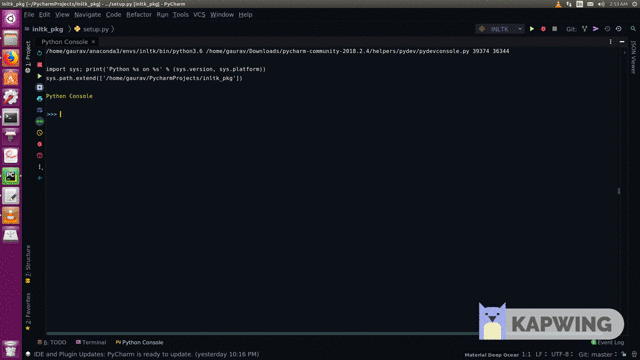

## Natural Language Toolkit for Indian Languages (iNLTK)



### Installation

```bash
pip install http://download.pytorch.org/whl/cpu/torch-1.0.0-cp36-cp36m-linux_x86_64.whl
pip install inltk
```

iNLTK runs on CPU and NOT on GPU, as is the desired behaviour for most
of the Deep Learning models in production.

The first command above will install pytorch-cpu, which, as the name suggests,
 does not have cuda support. 
 
`Note: inltk is currently supported only on Linux with Python >= 3.6`
 

### Supported languages

| Language | Code <code-of-language> |
|:--------:|:----:|
|   Hindi  |  hi  |
|  Punjabi |  pa  |
| Sanskrit |  sa  |
| Gujarati |  gu  |
|  Kannada |  kn  |
| Malyalam |  ml  |
|  Nepali  |  ne  |
|   Odia   |  or  |
|  Marathi |  mr  |
|  Bengali |  bn  |

### Usage

**Setup the language**

```bash
from inltk.inltk import setup

setup('<code-of-language>') // if you wanted to use hindi, then setup('hi')
```

`Note: You need to run setup('<code-of-language>') when you use a language 
for the FIRST TIME ONLY. This will download all the necessary models required
to do inference for that language.`

**Tokenize**

```bash
from inltk.inltk import tokenize

tokenize(text ,'<code-of-language>') // where text is string in <code-of-language>
```

**Predict Next 'n' words**

```bash
from inltk.inltk import predict_next_words

predict_next_words(text , n, '<code-of-language>') 

// text --> string in <code-of-language>
// n --> number of words you want to predict (integer)
```

`Note: You can also pass a fourth parameter, randomness, to predict_next_words.
It has a default value of 0.8`

**Identify language**

```bash
from inltk.inltk import identify_language

identify_language(text)

// text --> string in one of the supported languages

Example:

>> identify_language('न्यायदर्शनम् भारतीयदर्शनेषु अन्यतमम्। वैदिकदर्शनेषु ')
'sanskrit'

```

#### Repositories containing models used in iNLTK

| Language | Repository                                                      | Perplexity of Language model | Wikipedia Articles Dataset |   Classification accuracy   |     Classification Kappa score    |
|:--------:|-----------------------------------------------------------------|:----------------------------:|:--------------------------:|:---------------------------:|:---------------------------------:|
|   Hindi  | [NLP for Hindi](https://github.com/goru001/nlp-for-hindi)       |              ~36             |       55,000 articles      |  ~79 (News Classification)  | ~30 (Movie Review Classification) |
|  Punjabi | [NLP for Punjabi](https://github.com/goru001/nlp-for-punjabi)   |              ~13             |       44,000 articles      | ~89 (News Classification)   |     ~60 (News Classification)     |
| Sanskrit | [NLP for Sanskrit](https://github.com/goru001/nlp-for-sanskrit) |              ~6              |       22,273 articles      | ~70 (Shloka Classification) |    ~56 (Shloka Classification)    |
| Gujarati | [NLP for Gujarati](https://github.com/goru001/nlp-for-gujarati) |              ~34             |       31,913 articles      |  ~91 (News Classification)  |     ~85 (News Classification)     |
|  Kannada | [NLP for Kannada](https://github.com/goru001/nlp-for-kannada)   |              ~70             |       32,997 articles      |  ~94 (News Classification)  |     ~90 (News Classification)     |
| Malyalam | [NLP for Malyalam](https://github.com/goru001/nlp-for-malyalam) |              ~26             |       12,388 articles      |  ~94 (News Classification)  |     ~91 (News Classification)     |
|  Nepali  | [NLP for Nepali](https://github.com/goru001/nlp-for-nepali)     |              ~32             |       38,757 articles      |  ~97 (News Classification)  |     ~96 (News Classification)     |
|   Odia   | [NLP for Odia](https://github.com/goru001/nlp-for-odia)         |              ~27             |       17,781 articles      |  ~95 (News Classification)  |     ~92 (News Classification)     |
|  Marathi | [NLP for Marathi](https://github.com/goru001/nlp-for-marathi)   |              ~18             |       85,537 articles      |  ~91 (News Classification)  |     ~84 (News Classification)     |
|  Bengali | [NLP for Bengali](https://github.com/goru001/nlp-for-bengali)   |              ~41             |       72,374 articles      |  ~94 (News Classification)  |     ~92 (News Classification)     |